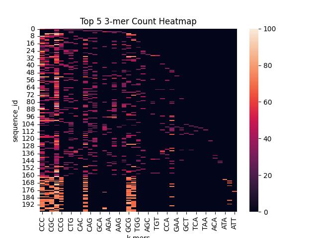

## Data validity

**List of invalid characters:**
- Sequence 12 - position 0: E
- Sequence 30 - position 0: N
- Sequence 52 - position 0: O
- Sequence 72 - position 0: M
- Sequence 100 - position 0: E
- Sequence 126 - position 0: H
- Sequence 150 - position 0: U
- Sequence 178 - position 0: N
 
**Total occurences per invalid character**: 
- Char E - 2
- Char N - 2
- Char O - 1
- Char M - 1
- Char H - 1
- Char U - 1

There are six letters that appear in the first position of six sequences. The characters are related to the IUPAC amino acid code, but they make little sense in the context of DNA sequences. The IUPAC nucleotide acid code would explain most the letters but not E or O. Furthermore, if there were ambiguity codes in the dataset, we would expect a higher occurrence and their presence in other positions as well. 

Since they only appear as the first character in eight sequences, they can be considered anomalies in the dataset. Hence, for simplicity, this short analysis will take in consideration only the four canonical bases (T,G,C,A) and remove the invalid characters.

## GC-content and Dinucleotide frequency

#### Overall GC-content

**Base statistics**
|       |   gc_content |
|:------|-------------:|
| count |    200       |
| mean  |     59.1422  |
| std   |      7.00817 |
| min   |     35.7     |
| 25%   |     55.075   |
| 50%   |     57.8     |
| 75%   |     63.525   |
| max   |     83.3     |

#### Dinucleotide frequencies

#### Clustering 

From the dinucleotide frequency heatmap, it seems that the DNA sequence could be divided at least into two or three distinct clusters. 
Indeed, a first cluster could be composed of those sequences having mostly GG,CC,GC,CG or AT,TT,AA,TA pairs, which suggest that the dna sequence is divided into areas having only G and C bases and areas having only A and T bases.

A second cluster could include all sequences that have a mixture of all dinucleotides. While a last cluster could be derived form this second cluster by separating all the sequences that have a deficit of CG pairs.

Let's apply hierarchical clustering!

The number of elements for each cluster are:
- **Cluster 1**: 45
- **Cluster 2**: 75
- **Cluster 3**: 80

Here, you can find the resulting dinucleotide frequency heatmap:

**Does the gc-content differ between clusters?**

- Overall GC-content in Cluster 1 has mean 55.3 and std of 0.7
- Overall GC-content in Cluster 2 has mean 55.0 and std of 5.7
- Overall GC-content in Cluster 3 has mean 65.1 and std of 5.6

**Is the difference statistically relevant?**

By performing an F test we have:

- F Test: statistic=96.5969, p-value=0.0000

The p-value is less than 0.05, indicating a statistically significant difference.

## Top 5 K-mers of lenght k = 3,4 and 5

A qualitative analysis of the top five K-mers of lenght 3,4,5, seems to confirm that there are at least two clusters in the dataset.

## Unusual patterns 

#### Palindromes

|   sequence_id | palindrome                         |   length |   start |   end |
|--------------:|:-----------------------------------|---------:|--------:|------:|
|            90 | CCGCCCCCTGCAGGGGGCGG               |       20 |     443 |   462 |
|           162 | TAAACGGGCCTTAATATATATTAAGGCCCGTTTA |       34 |     742 |   775 |
|           163 | GGCCCGCAAATAATTATTTGCGGGCC         |       26 |      30 |    55 |
|           164 | GCGCGGTAAAATATTTTACCGCGC           |       24 |       8 |    31 |
|           165 | GCGCCCACGTACGTGGGCGC               |       20 |     495 |   514 |

#### Tandem repeats

In this search, a tandem repeat had a minimum length of 1, a maximum length of 100 and had to repeat at least once.

|   sequence_id |   length | repeating_pattern                 |   n_repetitions |   start |   end |
|--------------:|---------:|:----------------------------------|----------------:|--------:|------:|
|            80 |       66 | CGGAAGAGGCGGAGTCTTCTTCCGAGGACCATT |               2 |     377 |   442 |
|           138 |       52 | CA                                |              26 |      94 |   145 |
|            96 |       52 | AG                                |              26 |     661 |   712 |
|           142 |       40 | GT                                |              20 |     788 |   827 |
|           130 |       36 | T                                 |              36 |     799 |   834 |
|           141 |       36 | CA                                |              18 |     385 |   420 |
|           114 |       36 | TGTAAACAGCCTCTGCGG                |               2 |     532 |   567 |
|           175 |       32 | CCCCGGCGCCCGCCCG                  |               2 |     377 |   408 |
|            60 |       32 | A                                 |              32 |      88 |   119 |
|            12 |       30 | CCGCCCCCCGCGGGG                   |               2 |     317 |   346 |

There are also various interesting tandem repeats. For example, in sequence 80 there is a tandem repeat of 66 nucleotides pairs, composed by repeating "CGGAAGAGGCGGAGTCTTCTTCCGAGGACCATT" twice. Among the longest and most repeated sequences there are the repeated patterns "CA", "AG" and "GT" with 26,26 and 20 repetitions each for a total lenght of 52,52 and 40 bases respectively.

What are the top 10 repeating patterns most repeated in a single tandem repeat?

|   sequence_id |   length | repeating_pattern   |   n_repetitions |   start |   end |
|--------------:|---------:|:--------------------|----------------:|--------:|------:|
|           130 |       36 | T                   |              36 |     799 |   834 |
|            60 |       32 | A                   |              32 |      88 |   119 |
|            95 |       28 | T                   |              28 |     631 |   658 |
|           138 |       52 | CA                  |              26 |      94 |   145 |
|            96 |       52 | AG                  |              26 |     661 |   712 |
|            41 |       22 | T                   |              22 |     852 |   873 |
|            42 |       22 | A                   |              22 |     224 |   245 |
|            55 |       22 | A                   |              22 |      16 |    37 |
|            45 |       20 | T                   |              20 |      13 |    32 |
|           142 |       40 | GT                  |              20 |     788 |   827 |

**What are the top 5 most common repeating patterns in the dataset?**

| repeating_pattern   |   n_repetitions |
|:--------------------|----------------:|
| G                   |           29070 |
| C                   |           27775 |
| T                   |           15720 |
| A                   |           15295 |
| GC                  |            1677 |
